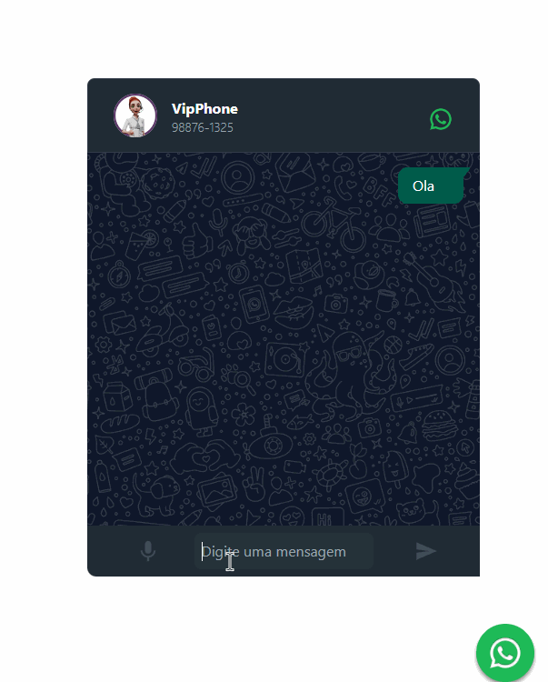

# WhatsApp Widget - Chat de Atendimento por IA
## OpenAI Integration & Gemini



**Funcionalidades**

- [x] Conversação 100% automatizada por IA
- [x] Widget de link direto para o WhatsApp
- [x] Componente de conversas em tempo real
- [x] Ícone e número personalizáveis
- [x] Widget de Link para Whatsapp


## Como Executar

 1. Configure o arquivo .env.
 2. Instale as dependências e inicie o projeto com os seguintes comandos:


```bash
    npm install
    npm run start
```

### Próximos Passos


- [ ] Criar biblioteca para reutilização do widget
